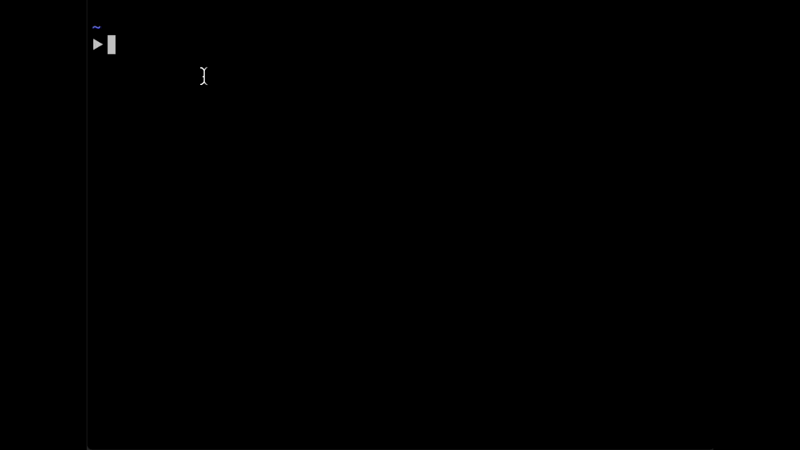

# json2struct

[](https://travis-ci.com/marhaupe/json2struct)
[](https://codecov.io/gh/marhaupe/json2struct)
[](https://godoc.org/github.com/marhaupe/json2struct)

This project aims to make your life a lot easier by automatically generating structs for a given JSON. 

# Installation

```bash
go get github.com/marhaupe/json2struct
```

# Usage

## Base command:

Calling `json2struct` without arguments opens the superior text editor for unix systems, vim 🤖. Insert the JSON data you want to parse and save and exit ([`:wq!`](https://stackoverflow.com/a/11828573/7471182)). Example:



## Flags:

### Call `json2struct -s` or `json2struct --string` with the JSON data as argument. 

Example:

```bash
 json2struct -s "$(curl "https://reqres.in/api/users?page=2")"
```

Result:
```go
type JSONToStruct struct {
        Page        int `json:"page"`        Per_page    int `json:"per_page"`
        Total       int `json:"total"`
        Total_pages int `json:"total_pages"`
        Data        []struct {
                Id         int    `json:"id"`
                First_name string `json:"first_name"`
                Last_name  string `json:"last_name"`
                Avatar     string `json:"avatar"`
        } `json:"data"`
}
```

The `string` option lets you pipe JSON data as input. The current implementation lacks some features, e.g. you need to escape quotes manually. PRs are more than welcome.


### Call `json2struct -f` or `json2struct --file` with the path to a JSON file as argument.

Example:

```bash
json2struct -f apiResult.json
```


### Lastly

Please feel free to open a pull request for missing features or bugs.

Credits to Matt Holt (https://github.com/mholt/json-to-go), from whom I got the idea.
