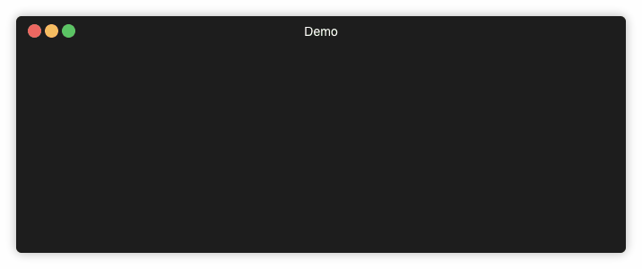

# json2struct


[](https://travis-ci.com/marhaupe/json2struct)
[](https://codecov.io/gh/marhaupe/json2struct)
[](http://makeapullrequest.com) 
<!-- [](https://godoc.org/github.com/marhaupe/json2struct) -->

> CLI tool to convert JSON to Go type definitions

At some point when dealing with JSONs in Go, you will have to write types to `json.Unmarshal` your JSONs into. Doing this by hand is not only repetitive and time consuming, but also error prone. `json2struct` saves you this work by automatically parsing the JSON and generating you the matching type definitions ready to be used.

Unlike other tools, `json2struct` tries to avoid generating `interface{}` and `map[string]interface{}` as much as possible. Nonetheless it's very fast 🚀.

# Installation

## Homebrew

```bash
brew tap marhaupe/json2struct https://github.com/marhaupe/json2struct 

brew install marhaupe/json2struct/json2struct
```


## Manually

Grab the latest release [binaries](https://github.com/marhaupe/json2struct/releases). 


# Usage

> json2struct [options]

Calling `json2struct` without flags opens a text editor. Simply input your JSON and save and exit. 



## Options
You probably don't want to manually write that 1MB JSON you have to generate a struct for by hand. I mean, if you really want to, I'm not here to judge, but that's not the point. These options will make your life easier. If you miss some, feel free to open an issue.


### Generating a struct from a string
>  -s, --string string:   JSON string

This is basically your bread and butter thanks to pipes. Usage:
```bash
 json2struct -s "$(curl "https://reqres.in/api/users?page=2")"
```
### Generating a struct from an existing file
>  -f, --file string:     path to JSON file 

This is useful if you have a JSON file stored in your filesystem and are too lazy to use pipes. Usage:
```bash
json2struct -f input.json
```

### Other options
> -b, --benchmark       measure execution time
> -h, --help            help for json2struct
>      --version         version for json2struct
